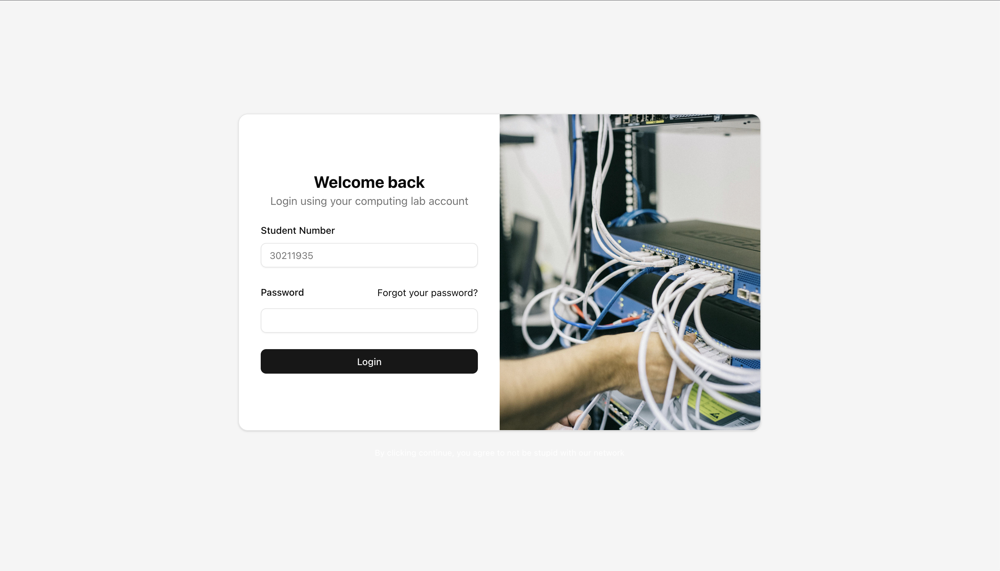

# StudentHV Project
This software is intended for colleges and schools to enable
students to create manage and connect to there own hyperv vms
from a simple interface. This software stops students from easly
being able to tamper with eachovers work during school time.

Origanly this software was built by me for the computing floor in
nescol but is now free and open for use for anyone to use or change
to there liking.

With some simple adaptions this project can be changed into lots of
things like a internal easy to use managment system for a companys
hyperv servers.

This project dose not require a database but one can be added at your
own will.

# Security
This project is ment to run internaly with no outside connection to
the internet. If you want to patch security flaws if you find any
feel free to send in a pull request.

# Documentation
This can be found in /docs

Thanks,
Struan